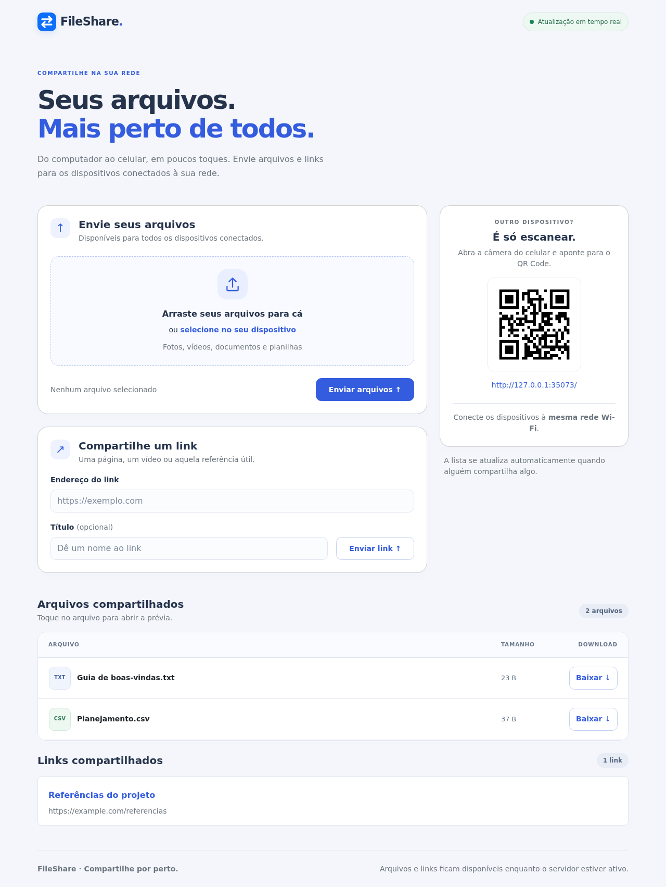

# FileShare

**Um ponto de encontro para arquivos e links na sua rede local.**

O FileShare facilita o compartilhamento de arquivos pelo navegador. Envie um arquivo pelo computador e baixe no celular ou faça o caminho inverso, sem instalar NADA!

O servidor roda em Python com FastAPI. A interface usa Bootstrap, funciona em telas pequenas e atualiza as listas automaticamente quando alguém compartilha um arquivo ou link.



*Captura real da interface com dados de demonstração. O endereço exibido corresponde ao servidor usado para a captura; na sua instalação, use o IP do computador na rede.*

## O que você pode fazer

- **Enviar e baixar arquivos** entre computadores, celulares e tablets na mesma rede.
- **Compartilhar links** com um título opcional.
- **Receber atualizações em tempo real**, sem recarregar a página.
- **Abrir prévias** clicando no nome ou no item da lista.

| Prévia | Recursos |
| --- | --- |
| Imagens | PNG, JPEG, GIF, WebP e AVIF, conforme suporte do navegador |
| Vídeo e áudio | Player com controles; reprodução depende do formato e codec suportados pelo navegador |
| PDF | Páginas renderizadas no servidor, navegação e sumário clicável a partir dos marcadores do documento |
| Excel | XLSX, XLSM e XLS em tabela, com seleção de abas e paginação |
| CSV e TSV | Detecção de separador, ajuste manual e primeira linha opcional como cabeçalho |
| Texto e código | Exibição como texto, limitada aos primeiros 100 KB |

PDFs sem marcadores mostram uma lista de páginas no lugar dos tópicos. Planilhas mostram 100 linhas por página, até 100 colunas e até 4.000 caracteres por célula. A prévia não reproduz gráficos ou estilos do Excel nem recalcula fórmulas. Os limites da prévia não alteram o arquivo disponível para download.

## Usar sem instalar Python

Baixe o pacote do seu sistema em **[GitHub Releases](https://github.com/RicardoJun10r/FileShareApp/releases/latest)** e extraia a pasta inteira.

| Pacote | Como iniciar |
| --- | --- |
| Windows x86_64 | Abra `FileShare.exe` |
| macOS arm64 (Apple Silicon) | Abra `Iniciar FileShare.command` |
| macOS x86_64 (Intel) | Abra `Iniciar FileShare.command` |
| Linux x86_64 | Execute `./FileShare` no terminal, dentro da pasta extraída |

O inicializador mostra o endereço da rede e abre a página no navegador. Escaneie o QR Code em outro dispositivo conectado à mesma rede. Se a porta 8000 estiver ocupada, ele procura outra até 8010.

**Mantenha o terminal aberto.** Para encerrar, pressione **Ctrl+C**. Não mova o executável para fora da pasta: os recursos e bibliotecas estão em `_internal`. Python, Bootstrap, favicon e PDFium já estão incluídos; não é preciso instalar Python ou Poppler.

Os pacotes não são assinados/notarizados e podem gerar avisos de origem no Windows/macOS. A release permanece acessível somente a quem tem acesso ao repositório enquanto ele for privado.

Opções no terminal (no Windows, use `FileShare.exe`):

```bash
./FileShare --no-browser
./FileShare --port 9000
./FileShare --version
```

## Executar pelo código-fonte


### 1. Prepare o computador que será o servidor

Você precisa de:

- **Python 3.13 ou superior**. O projeto usa Python 3.13 em `.python-version`.
- **[uv](https://docs.astral.sh/uv/getting-started/installation/)** para instalar e executar as dependências.
- **Git**, caso escolha clonar o repositório em vez de baixar o ZIP pelo GitHub.
- A prévia de PDFs usa **PDFium**, instalado automaticamente como dependência Python.

Clone o projeto e instale as dependências:

```bash
git clone https://github.com/RicardoJun10r/FileShareApp.git
cd FileShareApp
uv sync --locked
```

O Bootstrap e os recursos da interface estão incluídos no projeto: depois da instalação, a interface não depende de uma CDN ou de conexão com a internet. Links externos compartilhados ainda podem precisar de internet para abrir.

### 2. Inicie o FileShare

Na pasta do projeto, use o inicializador para abrir o navegador automaticamente:

```bash
uv run python launcher.py
```

Ou inicie apenas o servidor:

```bash
uv run uvicorn main:app --host 0.0.0.0 --port 8000
```

Mantenha esse terminal aberto. Para encerrar, pressione **Ctrl + C**.

No próprio computador, abra:

```text
http://localhost:8000
```

### 3. Acesse pelo celular ou outro computador

1. Conecte os dispositivos à mesma rede local, por Wi-Fi ou cabo.
2. Na página do FileShare, escaneie o QR Code com a câmera do celular.
3. Alternativamente, abra `http://IP-DO-COMPUTADOR:8000` no navegador do outro dispositivo.

Por exemplo, se o IP local for `192.168.1.20`, acesse:

```text
http://192.168.1.20:8000
```

Para descobrir o IP, consulte as configurações de rede do computador ou use `hostname -I` no Linux e `ipconfig` no Windows. Escolha o endereço da conexão usada pelos dispositivos, não o de uma interface virtual.

> `localhost` no celular aponta para o próprio celular. Para acessar o servidor, use o IP do computador. `0.0.0.0` é o endereço de escuta do servidor, não o endereço a digitar no navegador.

### 4. Compartilhe

- **Arquivo:** selecione ou arraste arquivos para a área de envio e clique em **Enviar arquivos**.
- **Prévia:** clique no item da lista; use **Baixar** para salvar o original.
- **Link:** informe um endereço HTTP/HTTPS, adicione um título se quiser e clique em **Enviar link**.

Todos os clientes conectados recebem as atualizações automaticamente.

### Se outro dispositivo não conseguir acessar

- Confira se o servidor está rodando com `--host 0.0.0.0`.
- Verifique se os dispositivos estão na mesma rede; redes de convidados podem bloquear a comunicação entre eles.
- Permita conexões à porta TCP `8000` no firewall pela rede local.
- Use `http://`, não `https://`, na configuração padrão.

Se o QR Code mostrar o endereço errado em um computador com várias interfaces ou VPN, abra a página usando o IP correto. Você também pode definir `FILESHARE_PUBLIC_URL` antes de iniciar o servidor:

```bash
# Linux/macOS — substitua pelo endereço da sua rede
FILESHARE_PUBLIC_URL=http://192.168.1.20:8000 uv run uvicorn main:app --host 0.0.0.0 --port 8000
```

```powershell
# Windows PowerShell
$env:FILESHARE_PUBLIC_URL = "http://192.168.1.20:8000"
uv run uvicorn main:app --host 0.0.0.0 --port 8000
```

Essa variável ajusta o endereço divulgado pelo QR Code; não altera a interface ou a porta em que o servidor escuta.

## Sistemas operacionais e compatibilidade

Há duas partes distintas: o **computador que executa o servidor** e os **dispositivos que acessam pelo navegador**.

| Plataforma | Uso | Situação atual |
| --- | --- | --- |
| Linux | Servidor e navegador | Ambiente em que os testes de integração e E2E foram executados |
| Windows | Servidor e navegador | Pacote x64 validado pelo workflow em Windows Server 2022; testes em desktops Windows 10/11 ainda pendentes |
| macOS | Servidor e navegador | Pacotes arm64 (runner macOS 14) e Intel (runner macOS 15), com teste do executável no workflow |
| Android e iOS/iPadOS | Cliente pelo navegador | Interface responsiva; acesso não exige Python no celular. A suíte usa emulação mobile, não aparelhos reais |

A validação automatizada da interface usa **Chromium**, nas larguras de **320, 375, 390, 768 e 1280 pixels**. Firefox, Safari e navegadores móveis reais ainda não têm uma matriz de testes própria. A compatibilidade dos testes Playwright também depende dos [requisitos oficiais do Playwright](https://playwright.dev/python/docs/intro).

Os pacotes são pastas portáteis compactadas, não instaladores. A release só é publicada quando os quatro builds e os testes dos executáveis passam. Em Linux, o pacote é gerado no Ubuntu 22.04 e requer glibc 2.35 ou superior; não é um binário para Alpine/musl. Versões de sistemas anteriores às usadas nos runners não foram validadas.

## Como o projeto está organizado

```text
FileShareApp/
├── launcher.py               # Inicializador: endereço da rede e navegador
├── pdf_preview.py            # Renderização PDFium incluída nos pacotes
├── scripts/                  # Build nativo e teste do pacote extraído
├── packaging/                # Instruções distribuídas e notas da release
├── .github/workflows/        # Builds por sistema e publicação
├── main.py                   # API, upload/download, SSE, links, QR Code e PDF
├── tabular_preview.py        # Leitura e paginação de Excel, CSV e TSV
├── pyproject.toml            # Dependências e configuração do pytest
├── uv.lock                   # Versões resolvidas das dependências
├── .python-version           # Versão de Python usada no projeto
├── static/
│   ├── index.html            # Estrutura da interface
│   ├── app.js                # Upload, prévias e atualização das listas
│   ├── styles.css            # Tema e ajustes responsivos sobre Bootstrap
│   ├── favicon.svg           # Ícone da aba do navegador
│   └── vendor/bootstrap/     # Bootstrap local, licença e informações da versão
├── tests/
│   ├── test_*.py             # Testes de integração e leitura de arquivos
│   └── e2e/
│       ├── conftest.py       # Servidor isolado e tamanhos de tela
│       └── test_fileshare.py # Fluxos no navegador com Playwright
└── docs/images/              # Capturas usadas nesta documentação
```

O navegador envia arquivos e links pela API. O servidor mantém os dados em memória e avisa os clientes por **Server-Sent Events (SSE)**. Ao receber o aviso, o JavaScript atualiza as listas. As prévias são carregadas quando o usuário abre um item.

## Limitações da versão atual

- **Armazenamento temporário:** arquivos e links desaparecem ao encerrar ou reiniciar o servidor. Arquivos grandes consomem a RAM do computador.
- **Um único processo:** use o comando de inicialização sem múltiplos workers. Os dados e as conexões SSE não são compartilhados entre processos.
- **Acesso pela rede:** não há autenticação. Quem conseguir acessar o servidor pode compartilhar e baixar conteúdo; o uso previsto é em uma rede local de confiança.
- **Desenvolvimento:** `--reload` pode ser adicionado ao comando do Uvicorn, mas cada reinicialização provocada por alterações no código apaga os dados em memória.

## Testes automatizados

Instale as dependências de desenvolvimento e o Chromium:

```bash
uv sync --locked --dev
uv run playwright install chromium
```

Execute os testes E2E:

```bash
uv run pytest tests/e2e -v
```

Cada caso inicia e encerra um servidor Uvicorn separado, com porta livre e dados isolados. Não é necessário iniciar o servidor manualmente, e a instância pessoal na porta `8000` não é utilizada.

A suíte cobre upload e download, atualização entre clientes, prévias, links, exibição do QR Code, sumário PDF, paginação CSV, abas Excel, erros JavaScript e rolagem horizontal indevida. A grade de planilhas pode rolar horizontalmente dentro da própria prévia.

```bash
# Todos os testes, incluindo os de integração
uv run pytest tests -v

# Acompanhar o navegador durante os E2E
uv run pytest tests/e2e --headed --slowmo 200

# Apenas a largura de 320 pixels
uv run pytest tests/e2e -k 320px -v
```

Falhas geram screenshots e traces em `test-results/`, ignorado pelo Git. Para abrir um trace, substitua o caminho abaixo pelo arquivo gerado:

```bash
uv run playwright show-trace test-results/<caso>/trace.zip
```

Em Linux, se faltarem bibliotecas do navegador, execute `uv run playwright install-deps chromium` — pode exigir privilégios de administrador. O renderizador PDFium é instalado junto com as dependências. O acesso pelo Wi-Fi e as regras do firewall precisam ser conferidos nos dispositivos reais.


## Gerar pacotes e publicar versões

O build usa PyInstaller em modo pasta (`onedir`). Cada sistema precisa de um build nativo; um pacote Linux não funciona no Windows ou macOS.

```bash
uv sync --locked --dev --group build
uv run --group build python scripts/build.py
uv run python scripts/smoke_package.py
```

O arquivo compactado aparece em `dist/`, com versão, sistema e arquitetura no nome. O smoke test extrai esse arquivo em uma pasta temporária e executa o programa sem Python ou Poppler no `PATH`, verificando recursos estáticos, upload/download, PDF, Excel, CSV, links e QR Code.

O workflow `.github/workflows/release.yml` cria quatro pacotes em runners nativos. Uma execução manual gera artefatos de teste; uma tag `v*` também publica a release após todos os builds passarem.

Para uma nova versão, atualize `project.version` em `pyproject.toml`, as instruções em `packaging/` e o lockfile. Faça commit e envie uma tag com a mesma versão. O workflow publica os pacotes e `SHA256SUMS.txt`, usando `packaging/RELEASE_NOTES.md` como instruções da release.
